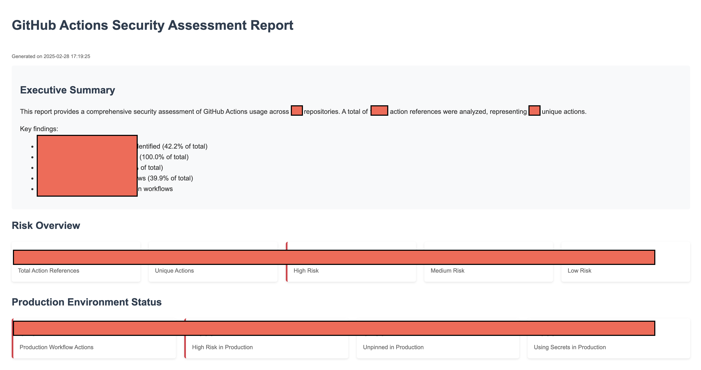
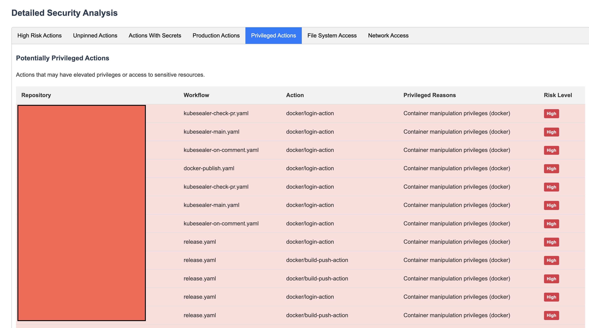
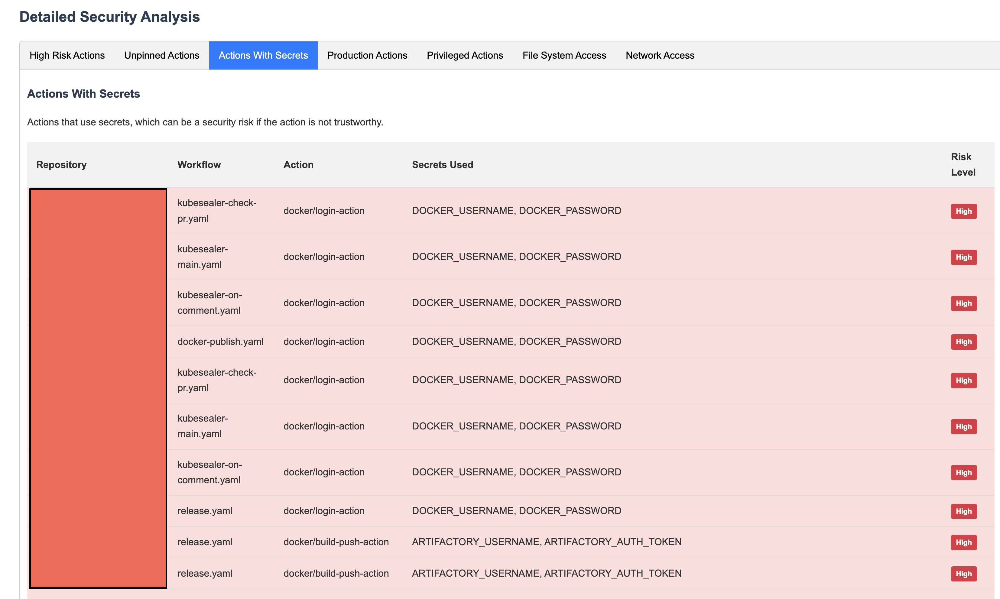

# actionScan
# GitHub Actions Security Scanner

A comprehensive security assessment tool for GitHub Actions usage across repositories.

## Overview

GitHub Actions Security Scanner is a powerful tool designed to help security teams identify, classify, and prioritize security risks in GitHub Actions workflows. It provides a detailed inventory of GitHub Actions used across your repositories, with a focus on potential security vulnerabilities such as unpinned actions, secret usage, and privileged operations.

## Key Features

- **Automated Discovery**: Scans repositories to create a complete inventory of GitHub Actions in use
- **Risk Classification**: Assigns risk scores based on multiple security factors
- **Access Pattern Detection**: Identifies potentially risky access patterns (privileged, file system, network)
- **Production Usage Insights**: Highlights actions used in production environments
- **Comprehensive Reporting**: Generates detailed HTML and Markdown reports with actionable insights
- **Multi-Organization Support**: Analyze actions across different GitHub organizations

## Why It Matters

GitHub Actions are powerful automation tools that often have access to sensitive resources like source code, deployment credentials, and infrastructure. Unpinned actions, excessive privileges, and poor secrets management can lead to supply chain attacks, credential theft, and infrastructure compromise.

This tool helps you:

1. **Identify Your Highest Risks**: Prioritize remediation by focusing on high-risk actions in production environments
2. **Prevent Supply Chain Attacks**: Find unpinned actions that could be hijacked 
3. **Secure CI/CD Pipelines**: Ensure actions with access to secrets are properly secured
4. **Monitor Continuously**: Track changes to your security posture over time

## Installation

```bash
# Clone the repository
git clone git@github.com:bilals12/actionScan.git
cd actionScan

# Set up a virtual environment
python3 -m venv venv
source venv/bin/activate

# Install dependencies
pip install -r requirements.txt
```

## Usage

### 1. Basic Setup

Create a `.env` file with your GitHub token:

```
GITHUB_TOKEN=your_github_token
GITHUB_ORG=your_github_organization
```

### 2. Collect Repository Information

```bash
# Get list of repositories
python repos..py --org-only
```

### 3. Collect Workflows

```bash
# Collect workflow files from all repositories
python workflow_collector.py
```

### 4. Extract and Analyze Actions

```bash
# Extract and analyze actions
python action_extractor.py
```

### 5. Generate Reports

```bash
# Generate security assessment reports
python report_generator.py
```

The tool will generate comprehensive reports in both HTML and Markdown formats in the `reports/` directory.

## Report Examples







### HTML Report

The HTML report includes:
- Executive summary with key findings
- Risk overview and security metrics
- Top repositories by risk
- Most used actions
- Critical production risks
- Detailed security analysis with tabs for different risk categories
- Recommendations and next steps

### Markdown Report

The Markdown report includes similar information, formatted for easy sharing in documentation, GitHub issues, or other markdown-compatible platforms.

## Security Recommendations

Based on the patterns identified by this tool, we recommend:

1. **Pin all actions to specific SHA commits** for predictable, secure builds
2. **Review high-risk actions** that have access to secrets
3. **Implement organization-wide policy** for GitHub Actions usage
4. **Set up continuous monitoring** to detect new unpinned or high-risk actions
5. **Validate third-party actions** are from trusted sources and recent commits

## Integration Options

You can integrate this tool into your security processes:

- **Regular Scans**: Run weekly or monthly to identify changes in your security posture
- **CI/CD Pipeline**: Run as part of your security validation process
- **Pre-merge Checks**: Validate new workflows before they're merged

## Contributing

Contributions are welcome! Please feel free to submit a Pull Request.

## License

This project is licensed under the Apache License 2.0 - see the LICENSE file for details.

## Acknowledgements

This tool was inspired by research from GitHub, Snyk, and Praetorian on GitHub Actions security best practices.
